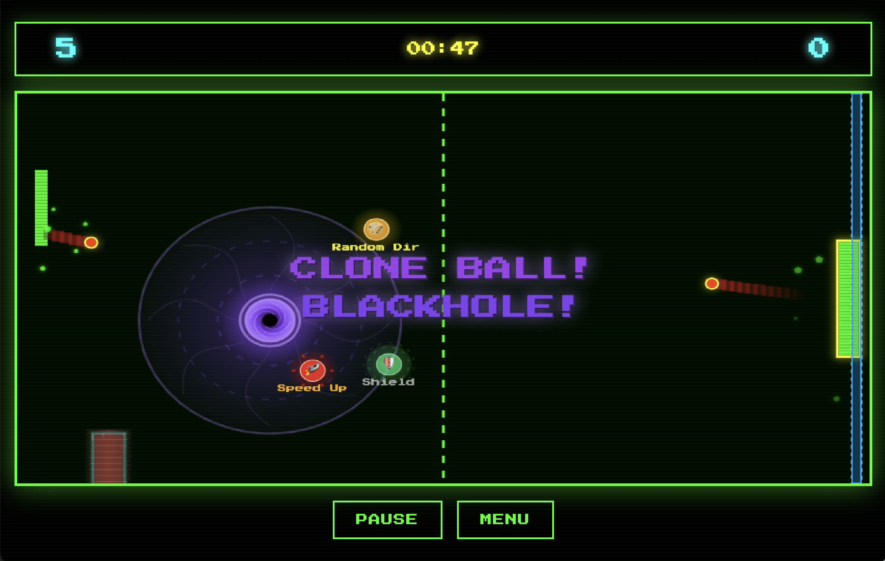
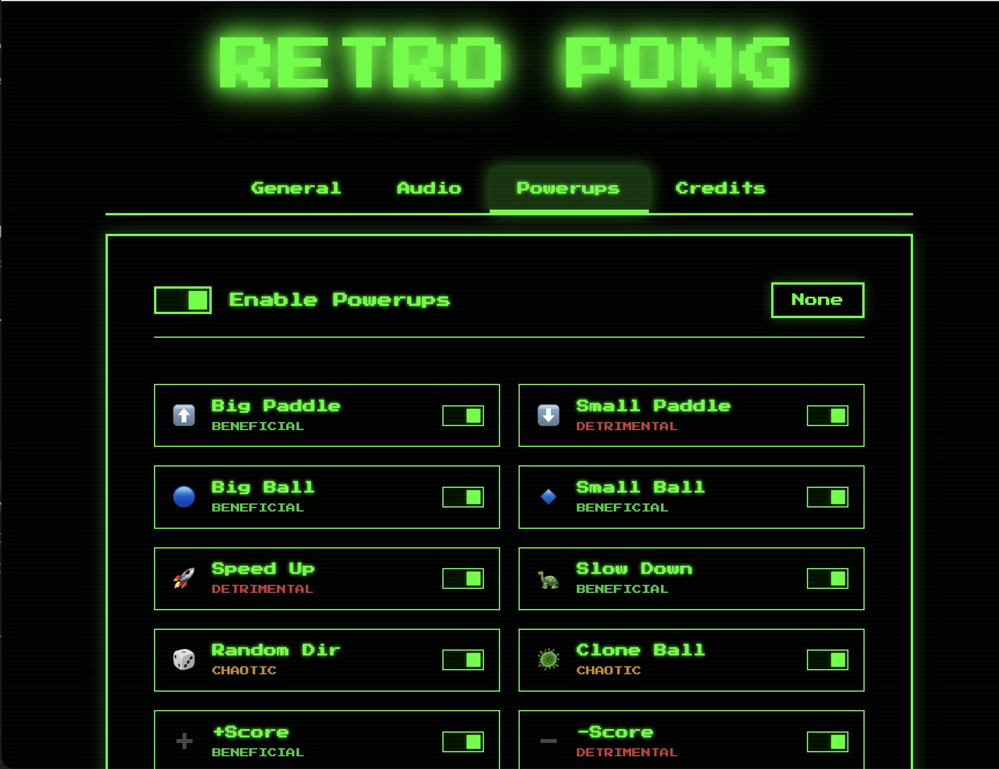

# Retro Pong Game with Powerups

[Play now](http://hoangtran99.is-a.dev/Pong/)

## Screenshots

## Gameplay demo

Youtube video: <https://www.youtube.com/watch?v=m2rvms8tTL0>

## Others versions

[Lovable](https://retro-ai-pong-chaos.lovable.app/)

## Credits

- Sound library: [Zzfx](https://killedbyapixel.github.io/ZzFX/)
- Music library: [ZzFXM](https://keithclark.github.io/ZzFXM/)
- Background music: [I am back](https://keithclark.github.io/ZzFXM/) - Original song by Sky
- Cursor IDE: [Cursor](https://www.cursor.com/)
- Claude-4-sonet model: [Claude](https://www.anthropic.com/claude/sonnet)
